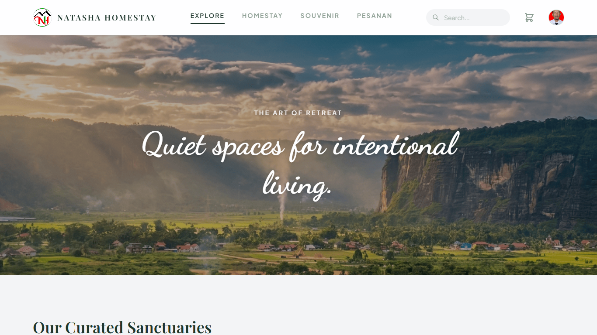
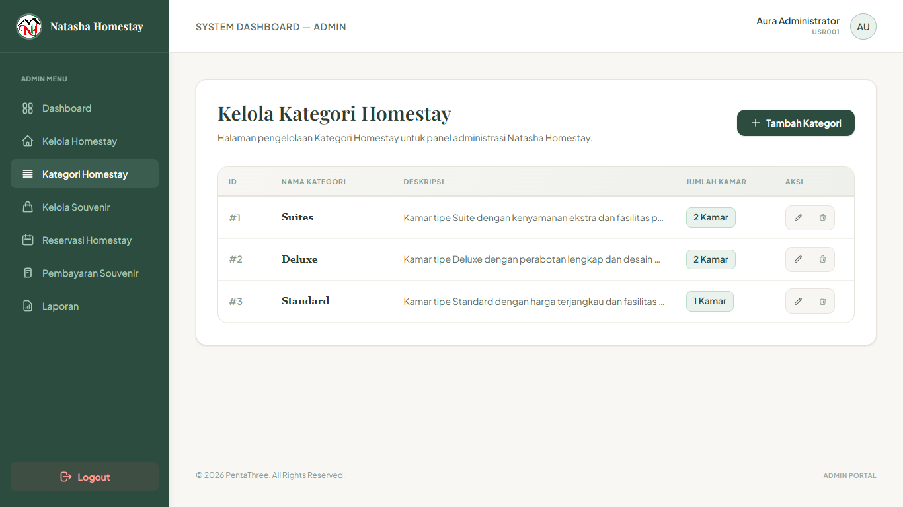
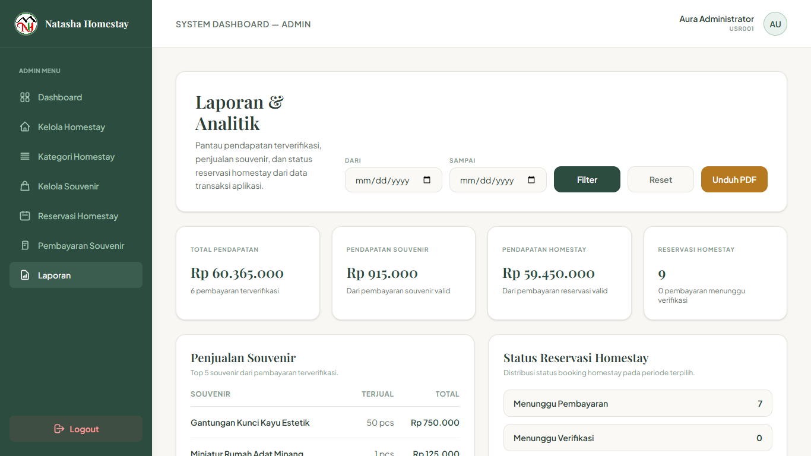

# Sistem Informasi Homestay dan Souvenir (SIMHOSUV)


Sistem Informasi Manajemen Homestay dan Penjualan Souvenir Berbasis Web pada Natasha Homestay & Harau Souvenir adalah aplikasi Laravel untuk membantu pengelolaan homestay, penjualan souvenir, pemesanan, pembayaran, reservasi, dan laporan usaha secara terintegrasi.

Status implementasi saat ini: **Sprint 8 selesai secara kode**. Project sudah memiliki auth, role admin/customer, CRUD homestay dan souvenir, katalog customer, keranjang, checkout, pemesanan, pembayaran manual, Midtrans Sandbox, admin reservasi, laporan PDF, dan test feature untuk modul utama.

---

## Deskripsi Proyek

Pengelolaan homestay dan penjualan souvenir secara manual dapat menimbulkan kendala seperti pencatatan reservasi yang tidak rapi, stok souvenir tidak terpantau, pembayaran sulit diverifikasi, dan laporan usaha sulit disusun.

SIMHOSUV dibuat untuk membantu proses tersebut agar lebih terstruktur. Customer dapat melihat katalog, melakukan booking homestay, membeli souvenir, membayar pesanan, dan melihat riwayat pesanan. Admin dapat mengelola data master, memantau pembayaran, mengatur status reservasi, serta mengunduh laporan PDF.

## Tujuan Sistem

- Menyediakan informasi homestay dan souvenir secara online.
- Memudahkan customer melakukan booking homestay.
- Memudahkan customer membeli souvenir melalui keranjang dan checkout.
- Memproses pembayaran manual dan Midtrans Sandbox.
- Membantu admin mengelola homestay, kategori, souvenir, pembayaran, reservasi, dan laporan.
- Menyediakan dokumentasi dan test agar project lebih siap untuk demo PBL.

## Aktor Sistem

| Aktor | Hak Akses |
| --- | --- |
| Customer | Register, login, melihat katalog homestay/souvenir, booking homestay, checkout souvenir, pembayaran, melihat riwayat pesanan |
| Admin | Login, dashboard admin, CRUD kategori homestay, CRUD homestay, CRUD souvenir, pembayaran souvenir, reservasi homestay, laporan PDF |
| Sistem | Membuat kode pemesanan, menghitung total, validasi stok, sinkron status Midtrans, update stok setelah pembayaran berhasil |

## Fitur Sistem

### Fitur Customer

| Fitur | Status |
| --- | --- |
| Login dan register | Selesai |
| Manajemen profil | Selesai |
| Katalog homestay dengan filter | Selesai |
| Booking homestay | Selesai |
| Katalog dan detail souvenir | Selesai |
| Keranjang souvenir | Selesai |
| Checkout souvenir | Selesai |
| Pembayaran manual | Selesai |
| Pembayaran Midtrans Sandbox | Selesai secara kode |
| Riwayat dan detail pesanan | Selesai |

### Fitur Admin

| Fitur | Status |
| --- | --- |
| Dashboard statistik database | Selesai |
| Manajemen kategori homestay | Selesai |
| Manajemen homestay | Selesai |
| Manajemen souvenir | Selesai |
| Manajemen pembayaran souvenir | Selesai |
| Manajemen reservasi homestay | Selesai |
| Laporan dan unduh PDF | Selesai |

### Fitur Teknis

| Fitur | Status |
| --- | --- |
| Role admin/customer dengan Spatie Permission dan fallback `users.role` | Selesai |
| Optimasi upload gambar dengan Intervention Image | Selesai |
| Payment settlement agar stok tidak berkurang ganda | Selesai |
| Webhook Midtrans dan fallback cek status | Selesai |
| Test feature Laravel/Pest | Selesai |
| GitHub Actions testing dan linting | Tersedia |

### Fitur Belum / Opsional

| Fitur | Status |
| --- | --- |
| Invoice customer | Sprint 4 di-skip sementara |
| Public homepage | Opsional Sprint 9 |
| Ulasan/rating | Opsional Sprint 9 |
| Fasilitas homestay | Opsional Sprint 9 |
| Midtrans Production | Belum, butuh aktivasi merchant |

---

## Alur Utama Sistem

### Alur Pembelian Souvenir

1. Customer login.
2. Customer membuka katalog souvenir.
3. Customer melihat detail souvenir.
4. Customer menambahkan souvenir ke keranjang.
5. Customer checkout dan memilih metode pengiriman.
6. Sistem membuat `pemesanans` dan `detail_pemesanans`.
7. Customer diarahkan ke halaman pembayaran.
8. Customer memilih transfer manual atau Midtrans.
9. Setelah pembayaran selesai, customer diarahkan ke riwayat pesanan.
10. Jika pembayaran terverifikasi, stok souvenir berkurang satu kali.

### Alur Reservasi Homestay

1. Customer login.
2. Customer membuka katalog homestay.
3. Customer memilih homestay.
4. Customer mengisi check-in, check-out, jumlah tamu, dan catatan.
5. Sistem menghitung jumlah malam dan total harga.
6. Sistem membuat pemesanan homestay.
7. Customer diarahkan ke halaman pembayaran.
8. Admin dapat memantau dan memperbarui status reservasi.

### Alur Pembayaran Midtrans

1. Customer membuka halaman pembayaran.
2. Customer memilih Midtrans Online.
3. Sistem membuat Snap token.
4. Popup Midtrans Sandbox tampil.
5. Setelah Midtrans dipilih, metode pembayaran dikunci ke Midtrans.
6. Sistem menerima webhook atau customer menekan cek status sebagai fallback.
7. Jika settlement/capture sukses, payment diverifikasi otomatis.
8. Jika deny/expire/cancel/failure, payment ditolak dan stok tidak berubah.

---

## Teknologi yang Digunakan

| Komponen | Teknologi |
| --- | --- |
| Backend Framework | Laravel 13 |
| Bahasa Backend | PHP 8.3+ |
| Frontend | Laravel Blade |
| Styling | Tailwind CSS 4 |
| Build Tool | Vite |
| Database | MySQL |
| Auth | Custom AuthController |
| Role | Spatie Laravel Permission |
| Payment Gateway | Midtrans Sandbox |
| PDF | Laravel DomPDF |
| Image Processing | Intervention Image |
| Testing | Pest dan PHPUnit |
| Formatter | Laravel Pint |
| CI | GitHub Actions |

---

## Instalasi Singkat

### 1. Clone Repository

```bash
git clone https://github.com/xayy28/pentathree-app.git
cd pentathree-app
```

### 2. Install Dependency

```bash
composer install
npm install
```

### 3. Konfigurasi Environment

```bash
cp .env.example .env
php artisan key:generate
```

Untuk Windows PowerShell:

```powershell
Copy-Item .env.example .env
php artisan key:generate
```

### 4. Konfigurasi Database

Buat database MySQL:

```sql
CREATE DATABASE pentathree_app;
```

Sesuaikan `.env`:

```env
DB_CONNECTION=mysql
DB_HOST=127.0.0.1
DB_PORT=3306
DB_DATABASE=pentathree_app
DB_USERNAME=root
DB_PASSWORD=
```

### 5. Konfigurasi Midtrans Sandbox

Isi key Sandbox dari dashboard Midtrans:

```env
MIDTRANS_SERVER_KEY=Mid-server-xxxxx
MIDTRANS_CLIENT_KEY=Mid-client-xxxxx
MIDTRANS_IS_PRODUCTION=false
MIDTRANS_IS_SANITIZED=true
MIDTRANS_IS_3DS=true
```

Jangan commit key asli ke repository.

### 6. Migrasi dan Seeder

```bash
php artisan migrate --seed
php artisan storage:link
```

### 7. Jalankan Aplikasi

```bash
php artisan serve
npm run dev
```

Akses:

```text
http://127.0.0.1:8000
```

---

## Akun Demo

| Role | Email | Password |
| --- | --- | --- |
| Admin | `admin@aura.com` | `admin123` |
| Customer | `user@aura.com` | `user123` |

---

## Testing dan Quality Gate

Jalankan test:

```bash
php artisan test
```

Format kode:

```bash
vendor\bin\pint --dirty
```

Build asset:

```bash
npm run build
```

Cek whitespace:

```bash
git diff --check
```

Status terakhir:

```text
php artisan test        = 86 passed
vendor\bin\pint --dirty = passed
npm run build           = passed
git diff --check        = clean
```

---

## Struktur Project

```text
pentathree-app/
|-- app/
|   |-- Http/Controllers/
|   |-- Http/Middleware/
|   |-- Models/
|   `-- Services/
|-- bootstrap/
|-- config/
|-- database/
|   |-- migrations/
|   `-- seeders/
|-- docs/
|   |-- screenshot/
|   |-- dependency.md
|   |-- features.md
|   |-- github_actions.md
|   |-- instalation.md
|   `-- refactoring.md
|-- public/
|-- resources/
|   |-- css/
|   |-- js/
|   `-- views/
|-- routes/
|-- storage/
|-- tests/
|-- README.md
|-- composer.json
`-- package.json
```

---

## Dokumentasi Proyek

| Dokumen | Keterangan |
| --- | --- |
| [docs/features.md](docs/features.md) | Dokumentasi fitur utama |
| [docs/instalation.md](docs/instalation.md) | Panduan instalasi dan konfigurasi |
| [docs/dependency.md](docs/dependency.md) | Analisis dependency project |
| [docs/refactoring.md](docs/refactoring.md) | Dokumentasi refactoring dan progress teknis |
| [docs/github_actions.md](docs/github_actions.md) | Dokumentasi GitHub Actions |

---

## Screenshot Hasil Project

Screenshot berikut diambil dari hasil project lokal pada `http://127.0.0.1:8000`.

| Halaman | Preview |
| --- | --- |
| Login |  |
| Register |  |
| Dashboard Customer |  |
| Profil User |  |
| Katalog Homestay |  |
| Booking Homestay |  |
| Katalog Souvenir |  |
| Detail Souvenir |  |
| Keranjang Souvenir |  |
| Checkout Souvenir |  |
| Pembayaran Customer |  |
| Webhook Midtrans |  |
| Riwayat Pesanan |  |
| Detail Pesanan |  |
| Dashboard Admin |  |
| Admin Kategori Homestay |  |
| Admin Homestay |  |
| Admin Souvenir |  |
| Admin Pembayaran |  |
| Admin Detail Pembayaran |  |
| Admin Reservasi |  |
| Admin Laporan |  |
| Role dan Hak Akses |  |
| Optimasi Upload Gambar |  |
| Testing Quality Gate |  |

---

## Progress Sprint

| Sprint | Nama | Status |
| --- | --- | --- |
| Sprint 0 | Stabilization | Done |
| Sprint 1 | Pemesanan Core | Done |
| Sprint 2 | Souvenir Checkout | Done |
| Sprint 3 | Payment Core | Done |
| Sprint 4 | Invoice | Skipped sementara |
| Sprint 5 | Homestay Booking | Done |
| Sprint 6 | Admin Reservation Management | Done |
| Sprint 6.5 | Stabilization and Demo Readiness | Done |
| Sprint 7 | Reports | Done |
| Sprint 8 | Midtrans Sandbox Integration | Done secara kode |
| Sprint 9 | Polish and Optional Scope | Next |

---

## Tim Pengembang - Kelompok PentaThree

| Nama | Peran |
| --- | --- |
| Zackri Kurnia Amri | Project Manager |
| Yelsa Pagansa Putri | Lead Programmer |
| Zikri Ilham Pratama | Lead Programmer |
| Muhammad Aufi Syahyudi | System Analyst |
| Taufiqurrahman | Quality Assurance |

---

## Status Akademik

Project ini dikembangkan untuk memenuhi tugas **Project Based Learning (PBL)** pada mata kuliah **Konstruksi dan Evolusi Perangkat Lunak**, Program Studi **D4 Teknologi Rekayasa Perangkat Lunak**, Jurusan **Teknologi Informasi**, **Politeknik Negeri Padang**.

## Lisensi

Project ini dikembangkan untuk tujuan akademik dan pembelajaran. Seluruh kode sumber dalam repository ini digunakan sebagai bagian dari kegiatan Project Based Learning (PBL).
