# Feature Documentation

Dokumen ini menjelaskan fitur-fitur utama pada project **PentaThree SIMHOSUV - Sistem Informasi Manajemen Homestay dan Penjualan Souvenir Berbasis Web pada Natasha Homestay & Harau Souvenir**.

Terakhir diperbarui: 2026-07-02

---

## 1. Login

### Tujuan Fitur

Fitur login digunakan agar admin dan pelanggan dapat masuk ke sistem menggunakan akun yang sudah terdaftar.

### Aktor

- Admin
- Customer

### Alur Fitur

User membuka halaman login, lalu memasukkan email dan kata sandi. Sistem memvalidasi data login melalui `AuthController`. Jika data benar, sistem membuat session login dan mengarahkan user sesuai role. Admin diarahkan ke dashboard admin, sedangkan customer diarahkan ke dashboard customer. Jika data salah, sistem menampilkan pesan error dan user tetap berada di halaman login.

### Route / Controller Terkait

- Route: `GET /login`
- Route: `POST /login`
- Controller: `AuthController`
- View: `resources/views/auth/login.blade.php`

### Screenshot Fitur

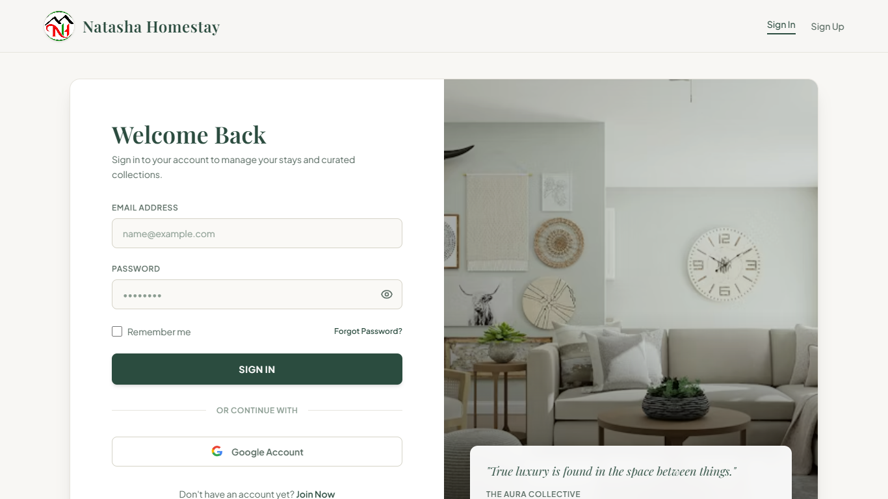

---

## 2. Register

### Tujuan Fitur

Fitur register digunakan agar customer dapat membuat akun baru sebelum melakukan pembelian souvenir atau reservasi homestay.

### Aktor

- Customer

### Alur Fitur

Customer membuka halaman register, lalu mengisi data akun seperti nama, email, nomor HP, alamat, kata sandi, dan konfirmasi kata sandi. Sistem memvalidasi data input, menyimpan akun baru ke tabel `users`, mengatur role customer, dan menyiapkan akun agar dapat digunakan untuk login.

### Route / Controller Terkait

- Route: `GET /register`
- Route: `POST /register`
- Controller: `AuthController`
- View: `resources/views/auth/register.blade.php`

### Screenshot Fitur

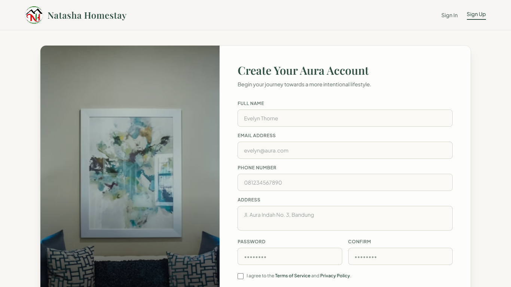

---

## 3. Dashboard Admin

### Tujuan Fitur

Dashboard admin digunakan untuk menampilkan ringkasan data operasional sistem secara cepat.

### Aktor

- Admin

### Alur Fitur

Admin berhasil login lalu diarahkan ke dashboard admin. Sistem menampilkan data ringkasan seperti total homestay, homestay baru bulan ini, total souvenir, souvenir tersedia, total reservasi, reservasi aktif, pendapatan bulan ini dari pembayaran terverifikasi, pembayaran menunggu verifikasi, total user, dan user baru bulan ini. Data dashboard dihitung langsung dari database.

### Route / Controller Terkait

- Route: `GET /admin/dashboard`
- Controller: Closure pada `routes/web.php`
- View: `resources/views/admin/dashboard.blade.php`

### Screenshot Fitur

---

## 4. Dashboard Customer

### Tujuan Fitur

Dashboard customer digunakan sebagai halaman awal customer setelah login.

### Aktor

- Customer

### Alur Fitur

Customer berhasil login lalu diarahkan ke dashboard customer. Dari halaman ini customer dapat mengakses katalog homestay, katalog souvenir, keranjang, riwayat pesanan, dan menu profil.

### Route / Controller Terkait

- Route: `GET /dashboard`
- Controller: Closure pada `routes/web.php`
- View: `resources/views/pelanggan/dashboard.blade.php`

### Screenshot Fitur

---

## 5. Manajemen Profil

### Tujuan Fitur

Fitur profil digunakan agar user dapat melihat dan memperbarui data akun.

### Aktor

- Admin
- Customer

### Alur Fitur

User membuka halaman profil untuk melihat data akun. User dapat mengubah data profil seperti nama, nomor HP, alamat, dan foto profil. User juga dapat mengganti password melalui halaman khusus. Upload foto diproses menggunakan `ImageUploadService` agar gambar lebih ringan dan tersimpan rapi.

### Route / Controller Terkait

- Route: `GET /profile`
- Route: `GET /profile/edit`
- Route: `PUT /profile`
- Route: `GET /profile/password/edit`
- Route: `PUT /profile/password`
- Controller: `ProfileController`

### Screenshot Fitur

---

## 6. Manajemen Kategori Homestay

### Tujuan Fitur

Fitur kategori homestay digunakan agar admin dapat mengelompokkan data homestay berdasarkan jenis atau kategori.

### Aktor

- Admin

### Alur Fitur

Admin membuka halaman kategori homestay. Sistem menampilkan daftar kategori yang sudah tersimpan. Admin dapat menambah kategori baru, mengubah data kategori, dan menghapus kategori. Jika kategori masih digunakan oleh data homestay, sistem mencegah penghapusan agar data homestay tidak rusak.

### Route / Controller Terkait

- Route: `GET /admin/kategori-homestay`
- Route: `GET /admin/kategori-homestay/create`
- Route: `POST /admin/kategori-homestay`
- Route: `GET /admin/kategori-homestay/{kategori_id}/edit`
- Route: `PUT /admin/kategori-homestay/{kategori_id}`
- Route: `DELETE /admin/kategori-homestay/{kategori_id}`
- Controller: `Admin\KategoriHomestayController`

### Screenshot Fitur

---

## 7. Manajemen Homestay

### Tujuan Fitur

Fitur manajemen homestay digunakan agar admin dapat mengelola data penginapan yang ditawarkan kepada customer.

### Aktor

- Admin

### Alur Fitur

Admin membuka halaman homestay untuk melihat daftar homestay. Admin dapat memfilter data berdasarkan kategori dan status, menambah homestay, mengubah data homestay, mengupload foto, serta menghapus homestay. Sistem memvalidasi status homestay agar hanya memakai nilai yang diizinkan. Jika homestay masih memiliki reservasi aktif, sistem mencegah penghapusan data.

### Route / Controller Terkait

- Route: `GET /admin/homestay`
- Route: `GET /admin/homestay/create`
- Route: `POST /admin/homestay`
- Route: `GET /admin/homestay/{homestay_id}/edit`
- Route: `PUT /admin/homestay/{homestay_id}`
- Route: `DELETE /admin/homestay/{homestay_id}`
- Controller: `Admin\HomestayController`

### Screenshot Fitur

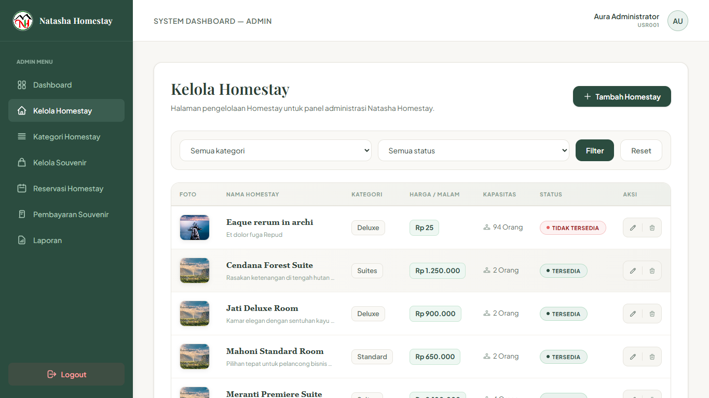

---

## 8. Manajemen Souvenir

### Tujuan Fitur

Fitur manajemen souvenir digunakan agar admin dapat mengelola produk souvenir yang dijual.

### Aktor

- Admin

### Alur Fitur

Admin membuka halaman souvenir untuk melihat daftar produk. Admin dapat menambah souvenir, mengubah data souvenir, mengupload foto, mengatur harga, stok, status, deskripsi, dan menghapus souvenir. Sistem juga menyimpan admin terakhir yang memperbarui data melalui field `updated_by`.

### Route / Controller Terkait

- Route: `GET /admin/souvenir`
- Route: `GET /admin/souvenir/create`
- Route: `POST /admin/souvenir`
- Route: `GET /admin/souvenir/{souvenir_id}/edit`
- Route: `PUT /admin/souvenir/{souvenir_id}`
- Route: `DELETE /admin/souvenir/{souvenir_id}`
- Controller: `Admin\SouvenirController`

### Screenshot Fitur

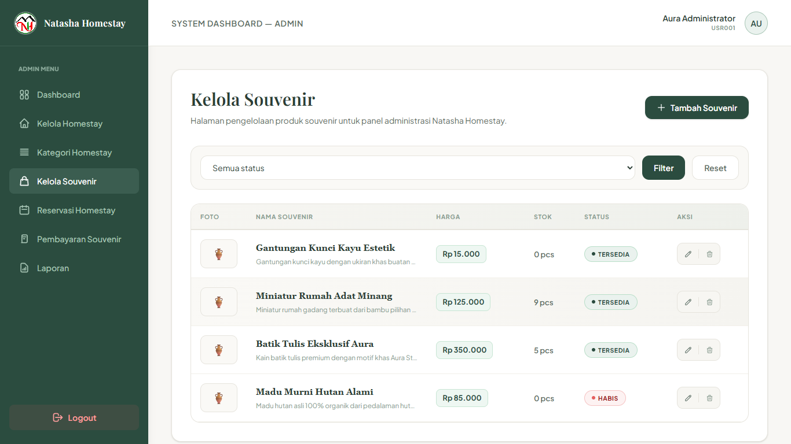

---

## 9. Katalog Homestay

### Tujuan Fitur

Katalog homestay digunakan agar customer dapat melihat daftar homestay yang tersedia sebelum melakukan booking.

### Aktor

- Customer

### Alur Fitur

Customer membuka halaman homestay. Sistem menampilkan daftar homestay lengkap dengan nama, kategori, harga per malam, kapasitas, status, detail, dan foto. Customer dapat menggunakan filter kategori, status, dan kapasitas tamu. Jika homestay tersedia, customer dapat melanjutkan ke halaman booking.

### Route / Controller Terkait

- Route: `GET /homestay`
- Controller: `Pelanggan\HomestayController`
- View: `resources/views/pelanggan/homestay/index.blade.php`

### Screenshot Fitur

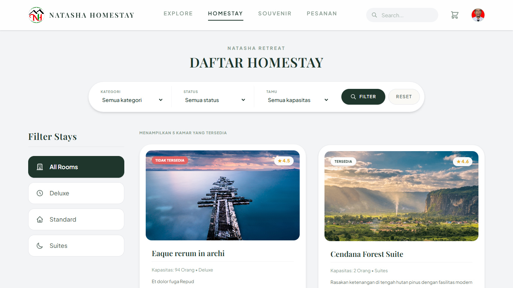

---

## 10. Booking Homestay

### Tujuan Fitur

Fitur booking homestay digunakan agar customer dapat melakukan reservasi homestay berdasarkan tanggal menginap.

### Aktor

- Customer

### Alur Fitur

Customer memilih homestay yang tersedia, lalu membuka halaman booking. Customer mengisi tanggal check-in, tanggal check-out, jumlah tamu, dan catatan opsional. Sistem memvalidasi tanggal, memastikan check-out setelah check-in, memastikan jumlah tamu tidak melebihi kapasitas, menghitung jumlah malam, dan menghitung total harga. Jika valid, sistem membuat data `pemesanans` dengan jenis `homestay` dan menyimpan detail booking ke `detail_pemesanans`. Setelah booking berhasil, customer langsung diarahkan ke halaman pembayaran.

### Route / Controller Terkait

- Route: `GET /homestay/{homestay_id}/booking`
- Route: `POST /homestay/{homestay_id}/booking`
- Controller: `Pelanggan\HomestayBookingController`

### Screenshot Fitur

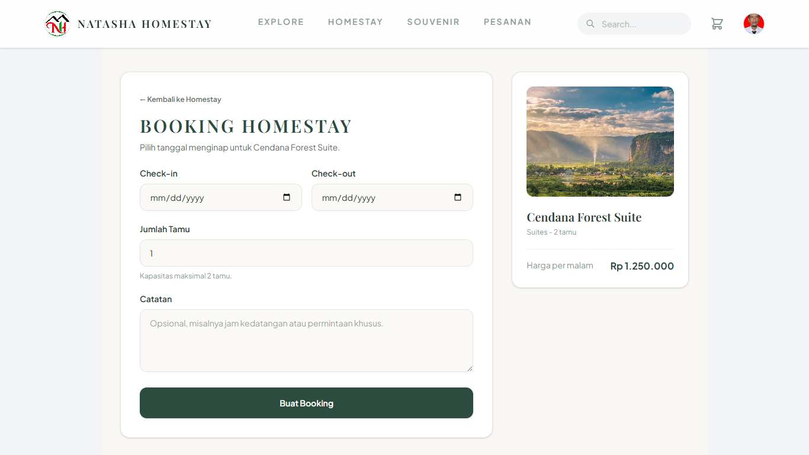

---

## 11. Katalog dan Detail Souvenir

### Tujuan Fitur

Fitur katalog dan detail souvenir digunakan agar customer dapat melihat produk souvenir yang tersedia sebelum membeli.

### Aktor

- Customer

### Alur Fitur

Customer membuka halaman souvenir. Sistem menampilkan produk souvenir beserta harga, stok, status, foto, dan jumlah terjual. Customer dapat memfilter souvenir berdasarkan status dan melihat produk terlaris. Customer dapat membuka detail souvenir untuk melihat informasi lebih lengkap, lalu memilih tombol Tambahkan ke Keranjang atau Pesan Sekarang.

### Route / Controller Terkait

- Route: `GET /souvenir`
- Route: `GET /souvenir/{souvenir_id}`
- Controller: `Pelanggan\SouvenirController`

### Screenshot Fitur

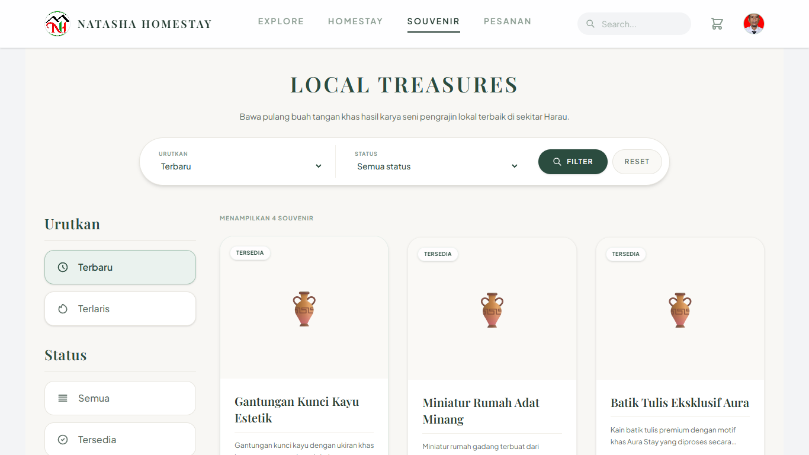

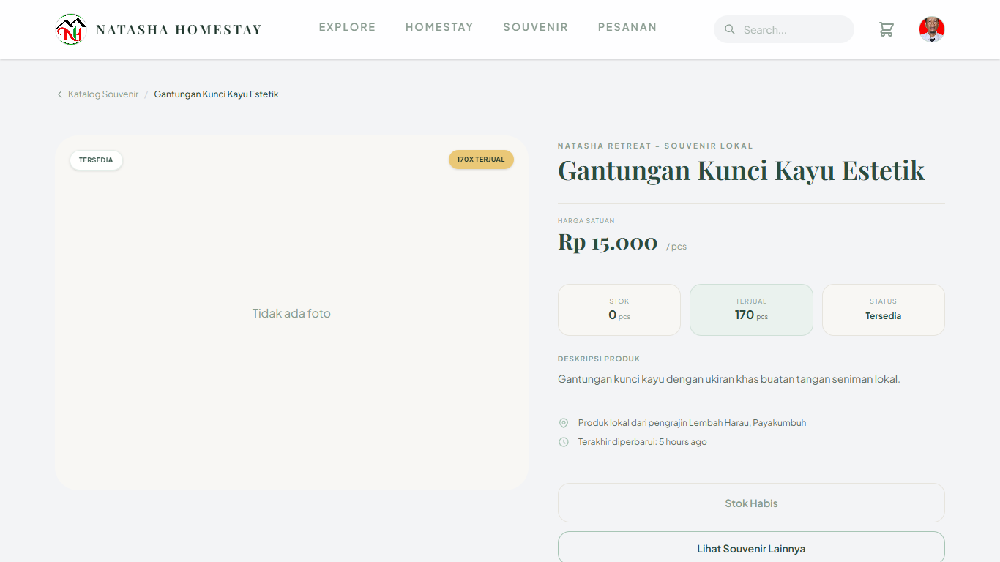

---

## 12. Keranjang Souvenir

### Tujuan Fitur

Fitur keranjang digunakan untuk menyimpan sementara souvenir yang ingin dibeli customer sebelum checkout.

### Aktor

- Customer

### Alur Fitur

Customer menambahkan souvenir ke keranjang dari halaman detail souvenir. Sistem membuat atau memperbarui data keranjang customer. Customer dapat membuka halaman keranjang untuk melihat daftar item, mengubah jumlah, menghapus item, dan melanjutkan ke checkout. Sistem memvalidasi stok agar jumlah item di keranjang tidak melebihi stok souvenir.

### Route / Controller Terkait

- Route: `GET /cart`
- Route: `POST /cart/add`
- Route: `PUT /cart/update`
- Route: `DELETE /cart/{id}`
- Controller: `Pelanggan\KeranjangController`

### Screenshot Fitur

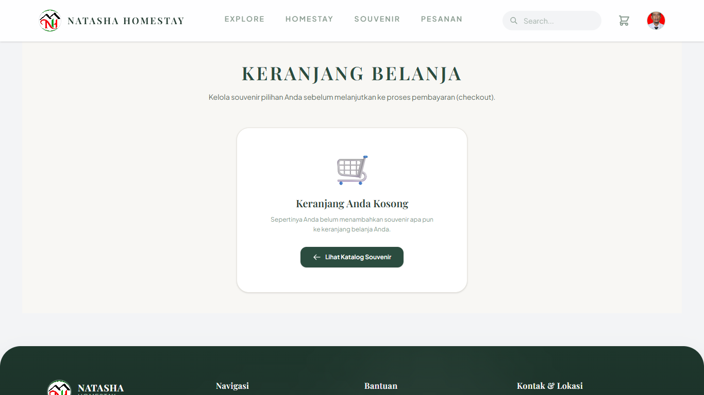

---

## 13. Checkout Souvenir

### Tujuan Fitur

Fitur checkout digunakan untuk mengubah isi keranjang menjadi pemesanan souvenir.

### Aktor

- Customer

### Alur Fitur

Customer membuka halaman checkout dari keranjang. Sistem menampilkan ringkasan item, subtotal, biaya layanan, pilihan pengiriman, dan total tagihan. Customer memilih metode pengiriman seperti pickup, ekspedisi, atau instan. Saat checkout diproses, sistem memvalidasi stok, membuat data `pemesanans` dengan jenis `souvenir`, menyalin item keranjang ke `detail_pemesanans`, menghitung total harga, mengosongkan keranjang, lalu mengarahkan customer ke halaman pembayaran.

### Route / Controller Terkait

- Route: `GET /cart/checkout`
- Route: `POST /cart/checkout`
- Controller: `Pelanggan\KeranjangController`

### Screenshot Fitur

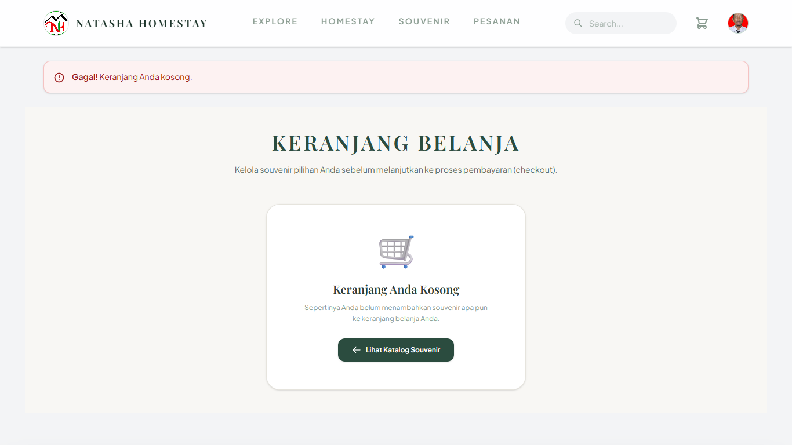

---

## 14. Pembayaran Customer

### Tujuan Fitur

Fitur pembayaran digunakan agar customer dapat membayar pemesanan souvenir atau reservasi homestay.

### Aktor

- Customer
- Sistem

### Alur Fitur

Setelah checkout souvenir atau booking homestay berhasil, customer langsung diarahkan ke halaman pembayaran. Customer dapat memilih Midtrans Online atau Transfer Manual. Jika memilih transfer manual, customer mengisi metode manual, jumlah bayar, dan mengupload bukti pembayaran. Jika memilih Midtrans, sistem membuat Snap token dan menampilkan popup pembayaran Midtrans Sandbox. Setelah Midtrans dipilih sekali, metode pembayaran dikunci ke Midtrans sehingga customer tidak dapat mengganti ke transfer manual. Setelah pembayaran sukses atau pending, customer diarahkan ke riwayat pesanan.

### Route / Controller Terkait

- Route: `GET /pesanan/{pemesanan_id}/pembayaran`
- Route: `POST /pesanan/{pemesanan_id}/pembayaran`
- Route: `POST /pesanan/{pemesanan_id}/midtrans-token`
- Route: `POST /pesanan/{pemesanan_id}/midtrans-status`
- Controller: `Pelanggan\PembayaranController`
- Controller: `Pelanggan\MidtransPaymentController`
- Service: `MidtransPaymentService`
- Service: `MidtransPaymentStatusService`

### Screenshot Fitur

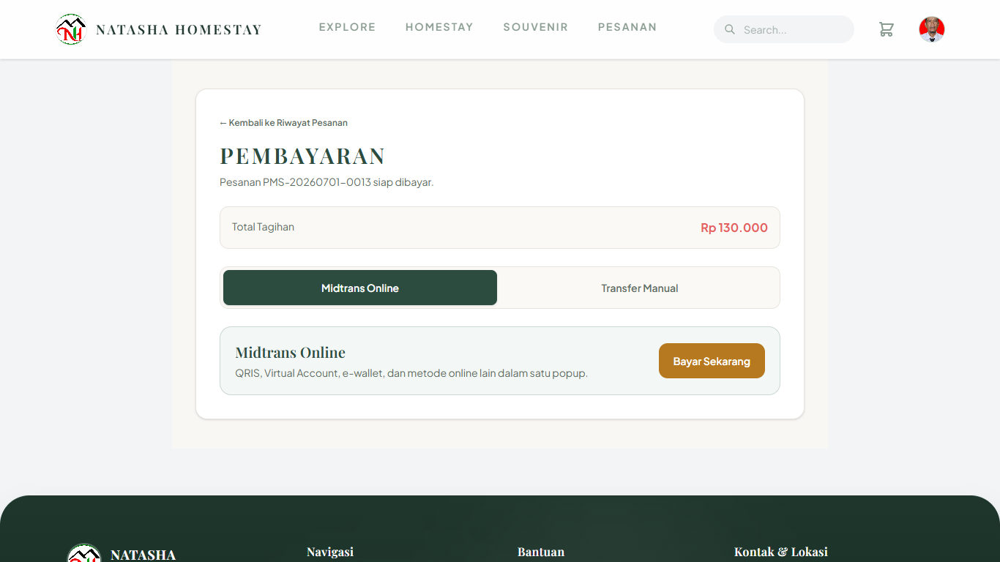

---

## 15. Webhook Midtrans

### Tujuan Fitur

Webhook Midtrans digunakan agar sistem dapat menerima notifikasi status pembayaran dari Midtrans.

### Aktor

- Sistem
- Midtrans

### Alur Fitur

Midtrans mengirim notifikasi transaksi ke endpoint webhook. Sistem memvalidasi signature key agar notifikasi benar-benar berasal dari Midtrans. Jika transaksi berstatus settlement atau capture sukses, sistem menandai pembayaran sebagai terverifikasi, memperbarui status pemesanan, mengurangi stok souvenir jika jenis pesanan adalah souvenir, dan menambah jumlah terjual. Jika transaksi pending, sistem mempertahankan status menunggu pembayaran. Jika transaksi deny, expire, cancel, atau failure, sistem menandai pembayaran ditolak tanpa mengurangi stok.

### Route / Controller Terkait

- Route: `POST /midtrans/notification`
- Controller: `MidtransWebhookController`
- Service: `MidtransPaymentService`
- Service: `MidtransPaymentStatusService`
- Service: `PaymentSettlementService`

### Screenshot Fitur

---

## 16. Riwayat Pesanan Customer

### Tujuan Fitur

Fitur riwayat pesanan digunakan agar customer dapat melihat daftar pemesanan souvenir dan reservasi homestay yang pernah dibuat.

### Aktor

- Customer

### Alur Fitur

Customer membuka halaman riwayat pesanan. Sistem menampilkan daftar pemesanan milik customer yang sedang login. Data yang ditampilkan mencakup kode pemesanan, jenis pemesanan, total harga, status pemesanan, status pembayaran, dan tanggal dibuat. Customer dapat membuka detail pesanan untuk melihat rincian item souvenir atau detail booking homestay.

### Route / Controller Terkait

- Route: `GET /pesanan`
- Route: `GET /pesanan/{pemesanan_id}`
- Controller: `Pelanggan\PemesananController`

### Screenshot Fitur

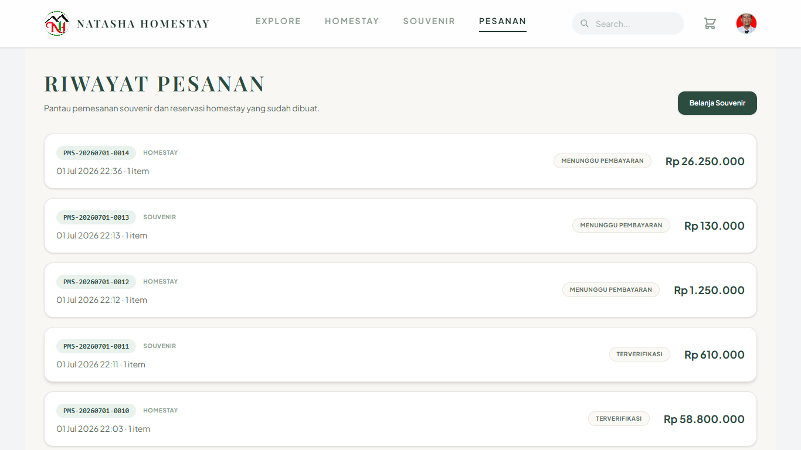

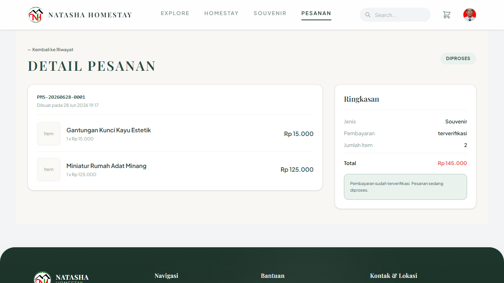

---

## 17. Admin Pembayaran Souvenir

### Tujuan Fitur

Fitur admin pembayaran digunakan agar admin dapat memantau dan memverifikasi pembayaran souvenir.

### Aktor

- Admin

### Alur Fitur

Admin membuka halaman pembayaran. Sistem menampilkan daftar pembayaran yang berasal dari pemesanan souvenir. Admin dapat memfilter pembayaran berdasarkan status seperti menunggu pembayaran, menunggu verifikasi, terverifikasi, dan ditolak. Admin dapat membuka detail pembayaran untuk melihat data customer, kode pemesanan, metode pembayaran, bukti pembayaran manual, atau data Midtrans. Untuk pembayaran manual, admin dapat memverifikasi atau menolak pembayaran. Saat pembayaran diverifikasi, sistem memperbarui status pembayaran, status pemesanan, stok souvenir, dan jumlah terjual.

### Route / Controller Terkait

- Route: `GET /admin/pembayaran`
- Route: `GET /admin/pembayaran/{pembayaran_id}`
- Route: `POST /admin/pembayaran/{pembayaran_id}/verify`
- Route: `POST /admin/pembayaran/{pembayaran_id}/reject`
- Controller: `Admin\PembayaranController`
- Service: `PaymentSettlementService`

### Screenshot Fitur

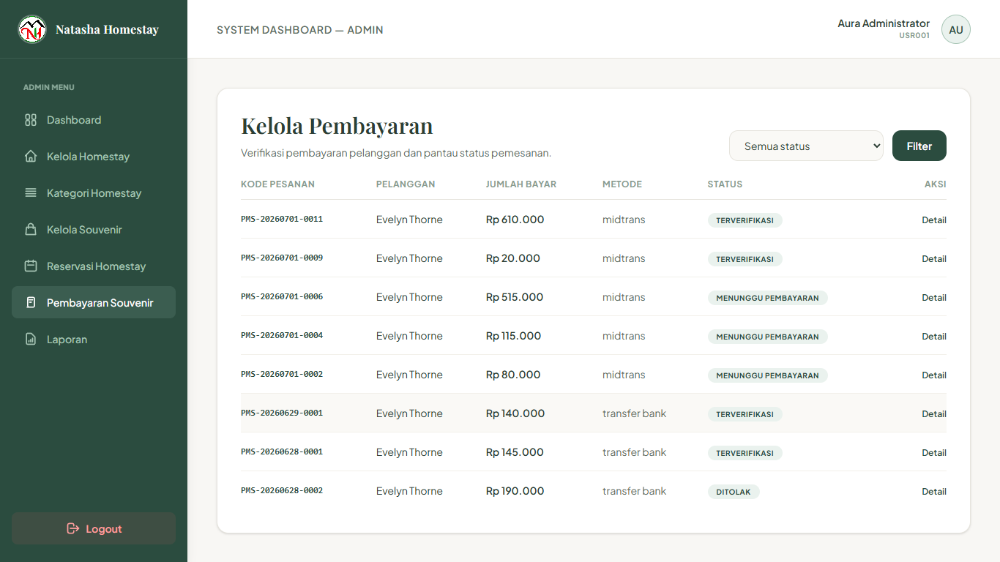

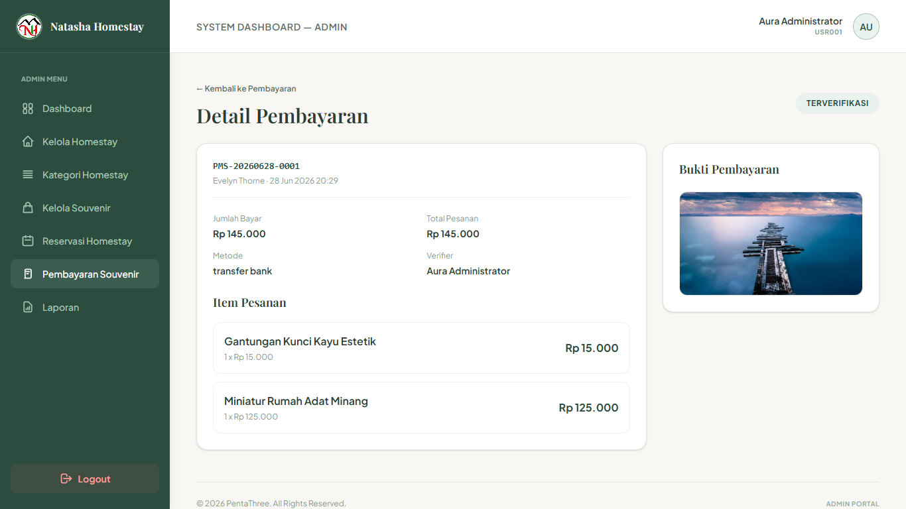

---

## 18. Admin Reservasi Homestay

### Tujuan Fitur

Fitur admin reservasi digunakan agar admin dapat memantau dan mengatur status reservasi homestay.

### Aktor

- Admin

### Alur Fitur

Admin membuka halaman reservasi. Sistem menampilkan daftar pemesanan dengan jenis `homestay`. Admin dapat memfilter reservasi berdasarkan status, membuka detail reservasi, melihat data customer, tanggal check-in, tanggal check-out, jumlah malam, total harga, dan status pembayaran. Admin dapat mengubah status reservasi menjadi diproses, dikonfirmasi, dibatalkan, atau selesai sesuai kondisi operasional.

### Route / Controller Terkait

- Route: `GET /admin/reservasi`
- Route: `GET /admin/reservasi/{pemesanan_id}`
- Route: `POST /admin/reservasi/{pemesanan_id}/status`
- Controller: `Admin\ReservasiController`

### Screenshot Fitur

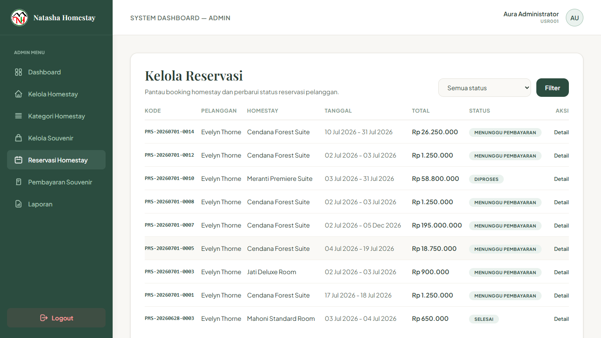

---

## 19. Laporan dan Unduh PDF

### Tujuan Fitur

Fitur laporan digunakan agar admin dapat melihat ringkasan pendapatan, penjualan souvenir, reservasi homestay, dan pembayaran terverifikasi.

### Aktor

- Admin

### Alur Fitur

Admin membuka halaman laporan. Sistem menampilkan ringkasan pendapatan dari pembayaran terverifikasi, jumlah pembayaran menunggu verifikasi, jumlah reservasi homestay, laporan penjualan souvenir, laporan status reservasi, dan daftar pembayaran terverifikasi terbaru. Admin dapat memilih rentang tanggal untuk memfilter laporan. Admin juga dapat menekan tombol Unduh PDF untuk mengunduh laporan dalam format PDF menggunakan DomPDF.

### Route / Controller Terkait

- Route: `GET /admin/laporan`
- Route: `GET /admin/laporan/pdf`
- Controller: `Admin\LaporanController`
- View PDF: `resources/views/admin/laporan/pdf.blade.php`

### Screenshot Fitur

---

## 20. Role dan Hak Akses

### Tujuan Fitur

Fitur role digunakan untuk membatasi akses halaman berdasarkan jenis user.

### Aktor

- Admin
- Customer
- Sistem

### Alur Fitur

Sistem memeriksa role user melalui `RoleMiddleware`. Admin hanya dapat mengakses halaman admin seperti dashboard admin, CRUD homestay, CRUD souvenir, pembayaran, reservasi, dan laporan. Customer hanya dapat mengakses halaman customer seperti dashboard, katalog, keranjang, checkout, pembayaran, dan riwayat pesanan. Role utama dikelola menggunakan Spatie Laravel Permission, sedangkan kolom `users.role` tetap digunakan sebagai fallback agar data lama tetap aman.

### Route / Controller Terkait

- Middleware: `RoleMiddleware`
- Model: `User`
- Package: `spatie/laravel-permission`
- Seeder: `DatabaseSeeder`

### Screenshot Fitur

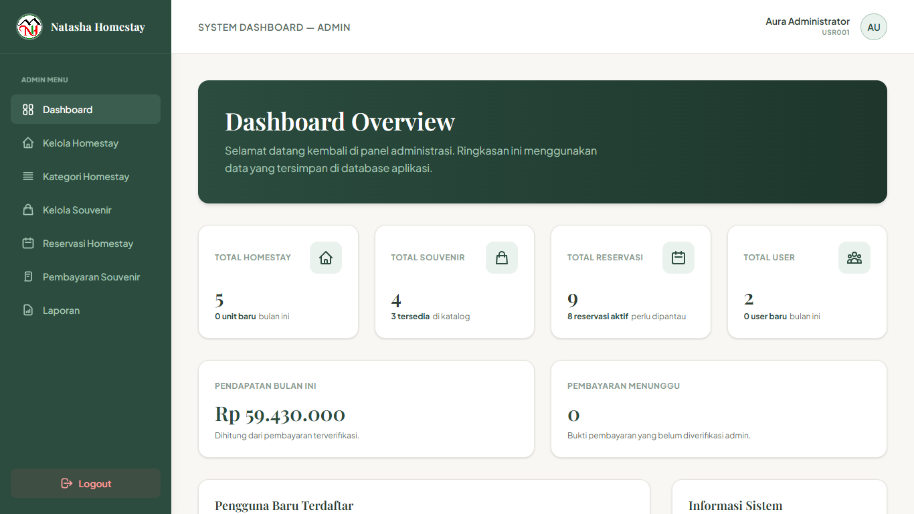

---

## 21. Optimasi Upload Gambar

### Tujuan Fitur

Fitur optimasi upload gambar digunakan agar file gambar yang diupload tidak terlalu besar dan tetap mudah ditampilkan pada website.

### Aktor

- Admin
- Customer
- Sistem

### Alur Fitur

Saat user mengupload foto profil, foto homestay, foto souvenir, atau bukti pembayaran, sistem memproses file melalui `ImageUploadService`. Service melakukan resize sesuai batas ukuran, mengubah output menjadi WebP untuk upload baru, lalu menyimpan file ke folder upload. Jika data lama memiliki gambar sebelumnya, sistem dapat menghapus gambar lama saat gambar diganti.

### Route / Controller Terkait

- Service: `ImageUploadService`
- Controller: `ProfileController`
- Controller: `Admin\HomestayController`
- Controller: `Admin\SouvenirController`
- Controller: `Pelanggan\PembayaranController`

### Screenshot Fitur

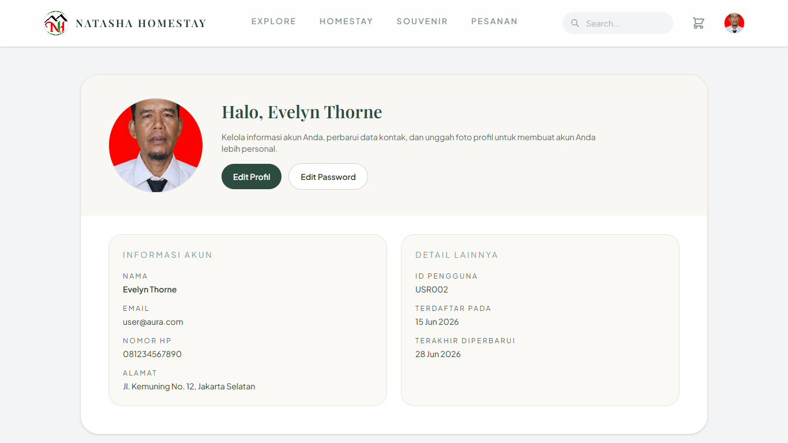

---

## 22. Testing dan Quality Gate

### Tujuan Fitur

Testing dan quality gate digunakan untuk memastikan fitur utama tetap berjalan setelah perubahan kode.

### Aktor

- Developer
- Sistem

### Alur Fitur

Developer menjalankan test menggunakan Pest melalui command `php artisan test`. Test mencakup autentikasi role, CRUD homestay, kategori homestay, souvenir, pemesanan, checkout souvenir, pembayaran, Midtrans, booking homestay, admin reservasi, dan laporan PDF. Developer juga menjalankan Laravel Pint untuk format kode, `npm run build` untuk memastikan asset frontend berhasil dibuild, serta `git diff --check` untuk memastikan tidak ada whitespace error.

### Route / Controller Terkait

- Test: `tests/Feature`
- Command: `php artisan test`
- Command: `vendor\bin\pint --dirty`
- Command: `npm run build`
- Command: `git diff --check`

### Screenshot Fitur

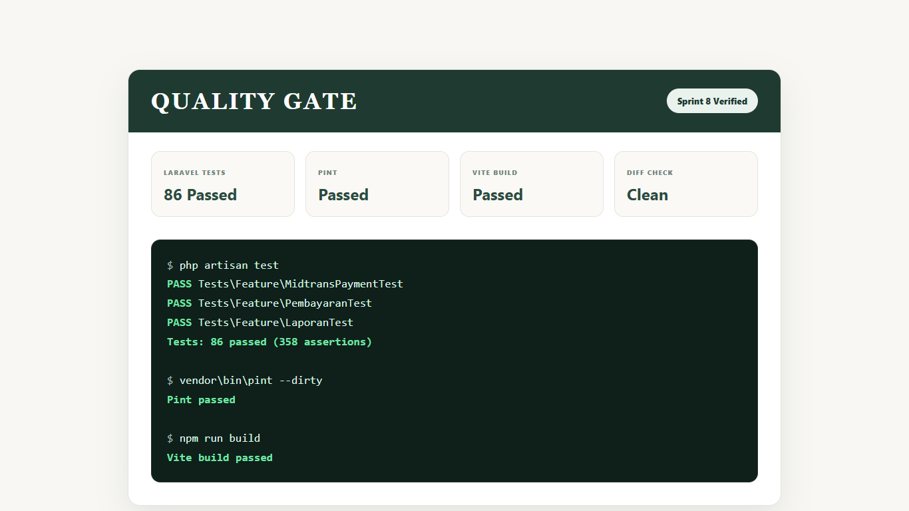

---

## Ringkasan Status Fitur

| Fitur | Status |
| --- | --- |
| Login dan register | Selesai |
| Role admin/customer | Selesai |
| Dashboard admin dan customer | Selesai |
| Profil user | Selesai |
| CRUD kategori homestay | Selesai |
| CRUD homestay | Selesai |
| CRUD souvenir | Selesai |
| Katalog homestay | Selesai |
| Booking homestay | Selesai |
| Katalog dan detail souvenir | Selesai |
| Keranjang souvenir | Selesai |
| Checkout souvenir | Selesai |
| Payment manual | Selesai |
| Midtrans Sandbox | Selesai secara kode |
| Riwayat pesanan | Selesai |
| Admin pembayaran | Selesai |
| Admin reservasi | Selesai |
| Laporan dan PDF | Selesai |
| Invoice customer | Belum, Sprint 4 di-skip sementara |
| Public homepage | Belum, opsional Sprint 9 |
| Ulasan/rating | Belum, opsional Sprint 9 |
| Fasilitas homestay | Belum, opsional Sprint 9 |
